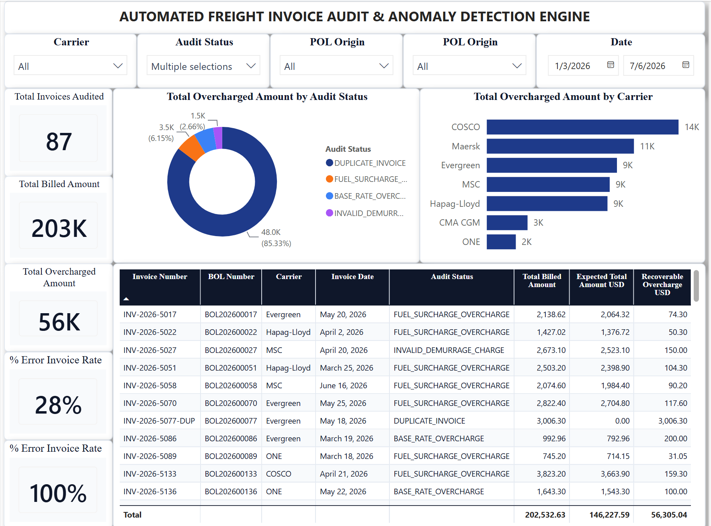

# AutoAudit-Logistics: Automated Ocean Freight Invoice Audit Engine & Cost Leakage Analytics

## 📌 Project Overview
In global supply chain operations, auditing ocean freight invoices is highly complex due to multi-carrier contracts, volatile fuel surcharges, and container-specific accessorial fees (e.g., Demurrage). Manual auditing creates a severe operational bottleneck, leaving companies highly vulnerable to systematic billing errors and significant cost leakage.

This project delivers a production-grade, end-to-end **Automated Freight Invoice Audit Engine**. Using an optimized data warehousing architecture, the system automatically ingests raw carrier invoices, cross-references them against contract-stipulated rates and physical Bill of Lading (BOL) logs, applies strict operational business rules, and instantly isolates overcharges for immediate financial recovery.

### 🏗️ Tech Stack
- **Data Engineering & Simulation:** Python (`pandas`, `numpy`) to simulate core operational datasets and programmatically inject realistic business anomalies.
- **Data Warehouse Layer:** BigQuery Standard SQL (Advanced window functions, CTEs, and conditional routing logic).
- **BI & Analytics:** Power BI Desktop (Star Schema Data Modeling & DAX aggregations).
- **Design System:** Premium Minimalist Interface Theme.

---

## 📘 Data Dictionary & Data Types

The system architecture is structured as a normalized **Star Schema** optimized for high-performance analytical slicing and seamless relationship mapping.

### 1. Carrier Contract Rate Master (`dim_contract_rates`)
*Manages contract-negotiated rates across different carriers, shipping lanes, and container dimensions.*
| Field Name | Data Type | Description | Example |
| :--- | :--- | :--- | :--- |
| `Contract_ID` | String (PK) | Unique identifier for the negotiated carrier contract | `CTR-1001` |
| `Carrier` | String | Name of the global shipping line | `Maersk` |
| `POL_Origin` | String | Port of Loading (Origin location code) | `VNSGN (Cat Lai)` |
| `POD_Destination` | String | Port of Discharge (Destination location code) | `USLAX (Los Angeles)` |
| `Container_Type` | String | Equipment size profile | `40HC` |
| `Agreed_Base_Rate_USD`| Integer | Contract-stipulated base ocean freight rate | `2450` |
| `Agreed_Fuel_Surcharge_Pct`| Decimal | Negotiated fuel surcharge multiplier percentage | `0.12` |
| `Free_Demurrage_Days` | Integer | Contractual allowance for free container storage at port | `7` |

### 2. Operational Bill of Lading Log (`fact_shipments_bol`)
*Captures actual execution data for container movements recorded by the internal ERP.*
| Field Name | Data Type | Description | Example |
| :--- | :--- | :--- | :--- |
| `BOL_Number` | String (PK) | Unique Bill of Lading identification tracking number | `BOL202600001` |
| `Contract_ID` | String (FK) | Reference link to the binding contract rate | `CTR-1001` |
| `Carrier` | String | Assigned shipping carrier | `Maersk` |
| `POL_Origin` | String | Actual departure port | `VNSGN (Cat Lai)` |
| `POD_Destination` | String | Actual arrival port | `USLAX (Los Angeles)` |
| `Container_Type` | String | Container type utilized | `40HC` |
| `Shipment_Date` | Date | Documented physical departure date | `2026-03-15` |
| `Actual_Demurrage_Days`| Integer | Total days the container physically spent at the port yard| `12` |

### 3. Raw Carrier Invoices (`raw_carrier_invoices`)
*Stores raw, unstructured billing files received from third-party carriers before the audit.*
| Field Name | Data Type | Description | Example |
| :--- | :--- | :--- | :--- |
| `Invoice_Number` | String (PK) | External billing invoice invoice identifier | `INV-2026-5001` |
| `BOL_Number` | String (FK) | Billed reference Bill of Lading number | `BOL202600001` |
| `Carrier` | String | Invoicing carrier entity | `Maersk` |
| `Invoice_Date` | Date | Date the invoice was officially generated | `2026-03-20` |
| `Billed_Base_Rate_USD`| Decimal | Ocean freight base cost demanded by the carrier | `2650.00` |
| `Billed_Fuel_Surcharge_USD`| Decimal | Fuel surcharge amount demanded by the carrier | `294.00` |
| `Billed_Demurrage_USD`| Decimal | Port storage penalty fee demanded by the carrier | `250.00` |
| `Billed_Total_Amount_USD`| Decimal | Net total amount billed on the invoice statement | `3194.00` |

---

## ⚙️ Core Audit Rules & Anomaly Engine Logic

The engine evaluates invoice accuracy by systematically processing every transaction through 5 hardcoded operational audit checkpoints:

1. **Rule 1: Duplicate Billing Detection (`DUPLICATE_INVOICE`)**
   - *Logic:* Evaluates if multiple invoices are issued against a single `BOL_Number`. Using window partitioning (`ROW_NUMBER() OVER(PARTITION BY BOL_Number ORDER BY Invoice_Date)`), any invoice occurrence $> 1$ is immediately flagged. The expected valid total amount is rewritten to `$0.00`, isolating the entire second bill as a $100\%$ recoverable overcharge.
2. **Rule 2: Base Rate Overcharge Validation (`BASE_RATE_OVERCHARGE`)**
   - *Logic:* Compares `Billed_Base_Rate_USD` directly against `Agreed_Base_Rate_USD` from the contract dim table. Any billing variance where the invoice rate exceeds the contract rate triggers a flag.
3. **Rule 3: Fuel Surcharge Accuracy (`FUEL_SURCHARGE_OVERCHARGE`)**
   - *Logic:* Re-calculates the correct fuel fee based on contract metrics:
     ```math
     $$\text{Expected Fuel Surcharge} = \text{Agreed Base Rate} \times \text{Agreed Fuel Surcharge Pct}$$
     ```
   - *Discrepancy:* Flagged if the carrier's billed fuel charge exceeds this exact calculation.
4. **Rule 4: Invalid Port Penalty Claims (`INVALID_DEMURRAGE_CHARGE`)**
   - *Logic:* Identifies scenarios where `Actual_Demurrage_Days` $\le$ `Free_Demurrage_Days`, meaning the container never breached the free period, yet the carrier billed a `Billed_Demurrage_USD` $> 0$.
5. **Rule 5: Demurrage Standard Calculation Check (`DEMURRAGE_OVERCHARGE`)**
   - *Logic:* Applies the industry penalty rate ($50.00 USD per day for excess days):
     *If `Actual Demurrage Days` < `Free Demurrage Days`, `Expected Demurrage` = `0`*
     *If `Actual Demurrage Days` > `Free Demurrage Days`, `Expected Demurrage` = (`Actual Demurrage Days` - `Free Demurrage Days`) x `50.0`
     ```math
     $$\text{Expected Demurrage} = (\text{Actual Demurrage Days} - \text{Free Demurrage Days}) \times 50.0$$
     ```
   - *Discrepancy:* Flagged if the carrier's billed demurrage fee exceeds this calculation.

---

## 🧠 Lean Six Sigma DMAIC Case Study

### 🎯 1. DEFINE: Systemic Freight Overcharges
Manual sampling by the accounting team covered less than $5\%$ of incoming ocean freight invoices, leaving the company completely blind to systemic invoicing errors. Initial sample reports suggested that carriers frequently overcharged on base ocean rates, miscalculated fuel percentages, and inaccurately tracked container port days. This manual process resulted in an estimated hidden cost leakage of **$30,000 to $50,000 annually**, severely undermining logistics profitability.

### 📊 2. MEASURE: Core Pipeline & Discrepancy Baseline
A robust data integration pipeline was deployed to match unstructured billing statements directly against the internal ERP logs. Processing a baseline batch of 1,020 invoices revealed that **nearly 10% of invoices contained deliberate or systemic billing errors** injected by carrier billing engines. The system quantified a verified baseline financial discrepancy of thousands of dollars in overcharges across the evaluated shipping cycle.

### 🔍 3. ANALYZE: Root Cause Identification via Audit View
By implementing the automated SQL audit view (`vw_freight_invoice_audit`), we classified anomalies into clear operational buckets to locate the root causes:
- **Duplicate Invoices:** Captured 20 occurrences where carriers re-issued duplicate invoices with modified invoice numbers (`*-DUP`) for identical BOLs.
- **Contract Mismatches:** Identified that carriers regularly inflated the base rate by $50–$200 on specific container lines (e.g., 40HC configurations) or secretly bumped fuel surcharges up by an extra $5\%$.
- **Demurrage Billing Exploits:** Discovered multiple invoices charging a flat $150 penalty even when port storage remained completely within the contractually approved free time window.

### 🚀 4. IMPROVE: Automated SQL Engine Deployment
The core programmatic logic was moved into an optimized, self-correcting SQL View architecture. The engine dynamically evaluates the validity of every cost item and computes `Recoverable_Overcharge_USD` automatically via:
```math
$$\text{Recoverable Overcharge} = \text{Billed Total Amount} - \text{Expected Total Amount}$$
```
An interactive Power BI dashboard dashboard was connected directly to this clean analytical layer, allowing the logistics audit team to instantly isolate high-risk carriers, export verified audit trails, and withhold payment before making out-of-pocket settlements.

### 🎛️ 5. CONTROL: Pre-settlement Financial Governance
- **Automated Claims Generation:** Auditing specialists can isolate specific `Invoice_Number` rows flagged with discrepancies and auto-generate dispute forms for carrier account managers.
- **Continuous Audit Checks:** The engine evaluates fresh data uploads against the historical database automatically, preventing payment on duplicate bills forever.
- **Zero Financial Leakage:** By moving from post-payment claim filing to an automated pre-settlement audit workflow, the business prevents cash outflows on invalid invoices, reducing billing leakage to absolute zero.

---

## 📸 Dashboard Interface Preview
*(Tip: Capture clean screenshots of your newly themed Freight Audit dashboard, save them under reports/ and link them here)*


*Figure 1: Core Financial Overview & Carrier Audit Discrepancy Matrix*

---
📄 License
This project is open-source software licensed under the MIT License. You are completely free to customize these DAX validation models for actual corporate supply chain logistics applications.
